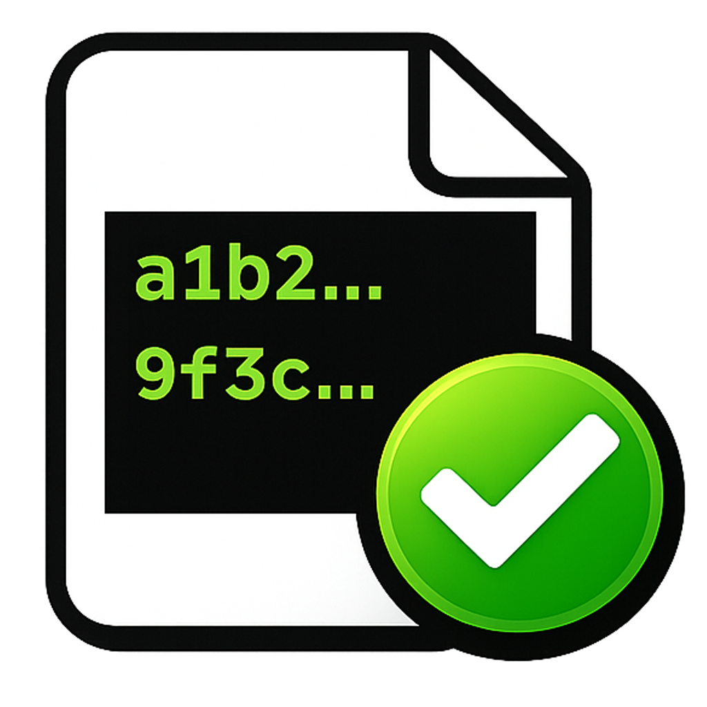
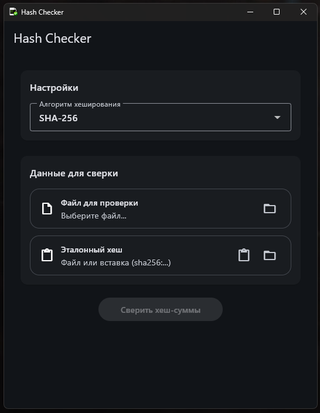
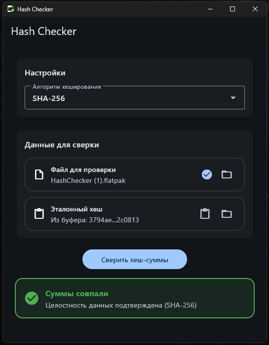
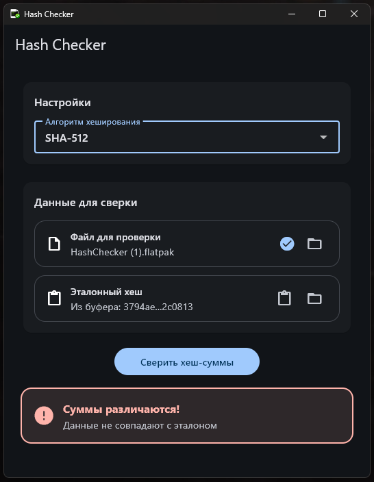

# HashChecker

<p align="center">
  
</p>

<p align="center">
  
  
  
</p>

Кроссплатформенная утилита для проверки контрольных сумм файлов.  
Поддерживает MD5, SHA-1, SHA-256, SHA-512.

## О проекте

Изначально проект был написан на Python + GTK4 (только для Linux).  
Начиная с версии 2.0.0 полностью переписан на Flutter.

Это дало:
- единый код для всех платформ
- поддержку Windows и Linux
- упрощение разработки и поддержки

## Скачать

Актуальные сборки доступны во вкладке Releases.

Windows:
- HashChecker-Setup.exe

Linux:
- будет добавлено (Flatpak или бинарник)

## Возможности

- Проверка хеш-сумм:
  - MD5
  - SHA-1
  - SHA-256
  - SHA-512
- Автоматическое определение алгоритма
- Вставка из буфера обмена
- Простой интерфейс

## Скриншоты

  
  


## Сборка из исходников

Требования:
- Flutter SDK

Установка:
https://docs.flutter.dev/get-started/install

### Запуск

```bash
flutter pub get
flutter run
````

### Сборка Windows

```bash
flutter build windows
```

После этого можно собрать установщик через Inno Setup:

```powershell
& "C:\Users\axawys\AppData\Local\Programs\Inno Setup 6\ISCC.exe" .\installer.iss
```

## Структура проекта

```text
lib/        — основной код
windows/    — Windows runner
linux/      — Linux runner
assets/     — ресурсы
packaging/  — установщик
```

## Планы

- Добавить Linux сборку в Releases
    
- Улучшить UI
    
- Поддержка drag & drop
    
- CLI-режим
    

## Лицензия

MIT License
