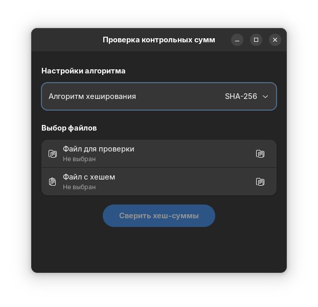
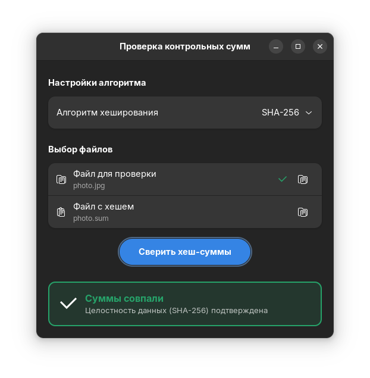
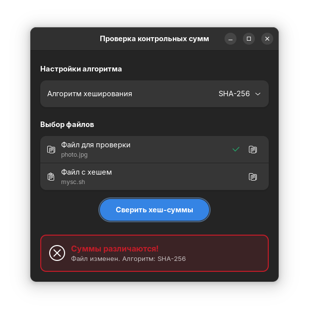

# Hash Checker

Утилита для быстрой проверки контрольных сумм (MD5, SHA-1, SHA-256, SHA-512) на GTK4 и Libadwaita.

## Установка

1. Убедитесь, что в вашей системе установлен Flatpak.
2. Скачайте файл `HashChecker.flatpak` из раздела [Releases](ссылка_на_ваши_релизы).
3. Установите его командой:
```bash
flatpak install --user HashChecker.flatpak
```



