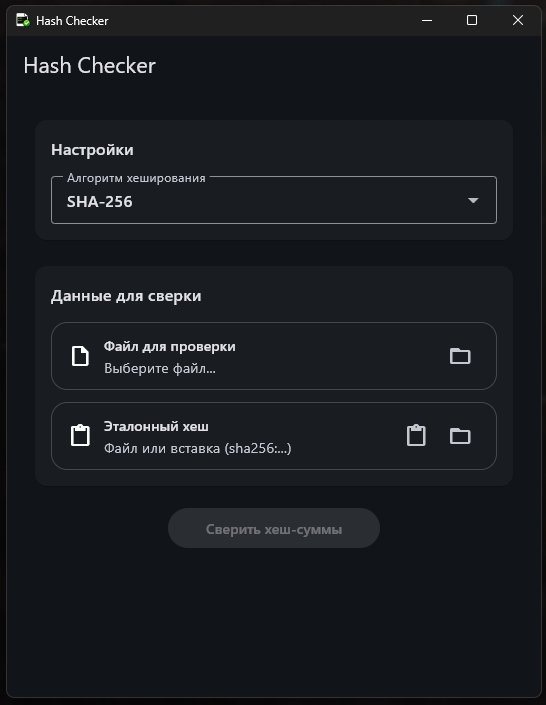
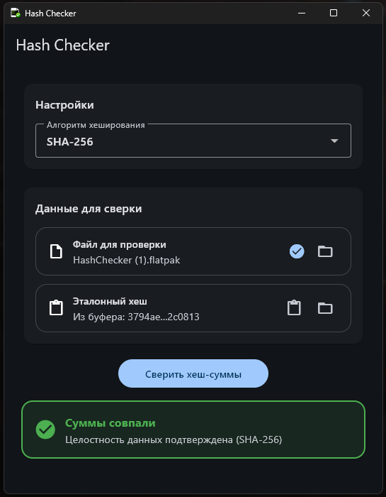
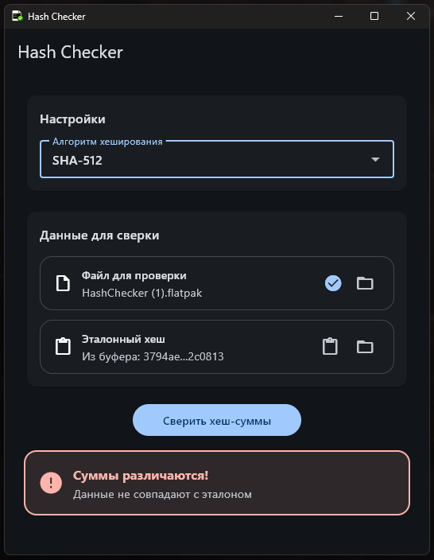

# HashChecker

<p align="center">
  
</p>

<p align="center">
  
  
  
  
</p>

HashChecker — простая кроссплатформенная утилита для проверки контрольных сумм файлов.
Приложение помогает сравнить рассчитанный хеш файла с эталонным значением и быстро
понять, совпадает ли файл с ожидаемой версией.

Поддерживаемые алгоритмы: MD5, SHA-1, SHA-256 и SHA-512.

## О проекте

Изначально HashChecker был написан на Python + GTK4 и работал только на Linux.
Начиная с версии 2.0.0 проект полностью переписан на Flutter.

Это позволило:
- использовать единый код для всех платформ
- добавить поддержку Windows и Linux
- упростить поддержку интерфейса и сборок

## Скачать

Готовые сборки доступны на странице
[Releases](https://github.com/Axawys/hash-checker/releases).

### Windows

Скачайте и запустите установщик:

[HashChecker-2.1.1-windows-x64-setup.exe](https://github.com/Axawys/hash-checker/releases/download/v2.1.1/HashChecker-2.1.1-windows-x64-setup.exe)

### Linux

Доступны пакеты для популярных сценариев установки:

- [hashchecker_2.1.1-1_amd64.deb](https://github.com/Axawys/hash-checker/releases/download/v2.1.1/hashchecker_2.1.1-1_amd64.deb)
- [hashchecker-2.1.1-1.x86_64.rpm](https://github.com/Axawys/hash-checker/releases/download/v2.1.1/hashchecker-2.1.1-1.x86_64.rpm)
- [hashchecker-2.1.1-linux-x64.tar.gz](https://github.com/Axawys/hash-checker/releases/download/v2.1.1/hashchecker-2.1.1-linux-x64.tar.gz)

DEB подходит для Debian, Ubuntu и совместимых дистрибутивов:

```bash
sudo apt install ./hashchecker_2.1.1-1_amd64.deb
```

RPM подходит для Fedora и совместимых дистрибутивов:

```bash
sudo dnf install ./hashchecker-2.1.1-1.x86_64.rpm
```

Tar.gz можно запускать без установки:

```bash
tar -xzf hashchecker-2.1.1-linux-x64.tar.gz
./hashchecker-2.1.1-linux-x64/hashchecker
```

Для установки tar.gz-версии в профиль пользователя:

```bash
./hashchecker-2.1.1-linux-x64/install.sh
```

## Возможности

- расчет хеша выбранного файла
- сравнение с эталонной контрольной суммой
- автоматическое определение алгоритма по длине хеша
- поддержка MD5, SHA-1, SHA-256 и SHA-512
- вставка эталонного значения из буфера обмена
- нативный выбор файла на Windows и Linux
- русский и английский интерфейс с автоматическим выбором языка системы

## Скриншоты







## Сборка из исходников

### Требования

- Flutter SDK
- Docker для сборки Linux-пакетов

Инструкция по установке Flutter:
[docs.flutter.dev/get-started/install](https://docs.flutter.dev/get-started/install)

### Запуск

```bash
flutter pub get
flutter run -d linux
```

Для Windows используйте:

```bash
flutter run -d windows
```

### Linux bundle

```bash
flutter build linux --release
```

Готовый bundle будет создан в:

```text
build/linux/x64/release/bundle/
```

### Linux-пакеты

Сборка Linux-пакетов выполняется через Docker. Готовые файлы складываются в `dist/`.

Отдельные форматы:

```bash
./packaging/linux/deb/build-deb.sh
./packaging/linux/rpm/build-rpm.sh
./packaging/linux/tar/build-tar.sh
```

Все Linux-пакеты сразу:

```bash
./packaging/linux/build-all.sh
```

### Windows

```bash
flutter build windows
```

После этого можно собрать установщик через Inno Setup:

```powershell
& "$env:LOCALAPPDATA\Programs\Inno Setup 6\ISCC.exe" .\packaging\windows\installer.iss
```

## Структура проекта

```text
lib/main.dart  — точка входа
lib/core/      — логика хеширования, парсинг эталона, утилиты
lib/ui/        — Flutter-интерфейс
assets/        — ресурсы
linux/         — Linux runner
packaging/     — файлы упаковки
windows/       — Windows runner
```

## Планы:
- CLI-режим

## Лицензия

Проект распространяется под лицензией MIT.
Подробнее см. файл [LICENSE](LICENSE).
